# 🔍 AlexNet-Based Image Classification using TensorFlow

<div align="center">


*A comprehensive implementation of the groundbreaking AlexNet architecture for image classification*

</div>

## 📌 Project Overview

This project implements **AlexNet**, a revolutionary Convolutional Neural Network (CNN) architecture, for image classification using TensorFlow. The implementation includes everything from scratch model building to comprehensive evaluation metrics.

### ✨ Key Features

- 🏗️ **Custom AlexNet Implementation** - Built from scratch using TensorFlow
- 🖼️ **Advanced Image Preprocessing** - Comprehensive data augmentation pipeline
- 📊 **Complete Evaluation Suite** - Multiple performance metrics and visualizations
- 🎯 **Transfer Learning Ready** - Optimized for fine-tuning on custom datasets
- 📈 **Performance Visualization** - Detailed charts and confusion matrices

## 🧠 What is AlexNet?

AlexNet is a deep convolutional neural network designed by **Alex Krizhevsky**, **Ilya Sutskever**, and **Geoffrey Hinton** in 2012. It revolutionized computer vision by winning the ImageNet Large Scale Visual Recognition Challenge (ILSVRC) 2012 with unprecedented accuracy.

### 🏆 Historical Significance
- First CNN to significantly outperform traditional methods on ImageNet
- Sparked the deep learning revolution in computer vision
- Introduced key concepts still used in modern architectures

## 🔧 AlexNet Architecture Highlights

| Feature | Specification |
|---------|---------------|
| **Layers** | 5 Convolutional + 3 Dense |
| **Parameters** | ~60 million |
| **Input Size** | 227×227×3 |
| **Activation** | ReLU (revolutionary at the time) |
| **Regularization** | Dropout + Data Augmentation |
| **Optimization** | GPU-accelerated training |

### 📐 Network Architecture

```
Input Image (227×227×3)
        ↓
Conv1 (96 filters, 11×11, stride=4) → ReLU → MaxPool
        ↓
Conv2 (256 filters, 5×5) → ReLU → MaxPool
        ↓
Conv3 (384 filters, 3×3) → ReLU
        ↓
Conv4 (384 filters, 3×3) → ReLU
        ↓
Conv5 (256 filters, 3×3) → ReLU → MaxPool
        ↓
Flatten → Dense(4096) → Dropout(0.5)
        ↓
Dense(4096) → Dropout(0.5)
        ↓
Dense(num_classes) → Softmax
```

## 🔄 Transfer Learning Capabilities

AlexNet excels in transfer learning scenarios:

- ✅ **Pre-trained on ImageNet** - Rich feature representations
- ✅ **Efficient Fine-tuning** - Requires less data for new tasks
- ✅ **Robust Feature Extraction** - Learns generalizable low-level features
- ✅ **Versatile Applications** - Adaptable to various image classification tasks

## 🚀 AlexNet vs. Vanilla CNN

| Feature | Vanilla CNN | AlexNet |
|---------|-------------|---------|
| **Depth** | Shallow (2-3 layers) | Deep (8 layers) |
| **Regularization** | Basic dropout | Advanced dropout + augmentation |
| **Activation** | Sigmoid/Tanh | ReLU |
| **Computation** | CPU-friendly | GPU-optimized |
| **Performance** | Limited | State-of-the-art (2012) |

## 🗃️ Dataset Structure

```
dataset/
├── class_1/
│   ├── image1.jpg
│   ├── image2.jpg
│   └── ...
├── class_2/
│   ├── image1.jpg
│   ├── image2.jpg
│   └── ...
└── ...
```

**Data Splits:**
- Training set (`train_df`)
- Validation set (`val_df`) 
- Test set (`test_df`)

## 🧼 Preprocessing Pipeline

### Image Transformations
- **Resizing**: 227×227 pixels (AlexNet standard)
- **Normalization**: Pixel values scaled to [0, 1]

### Data Augmentation
- 🔄 **Random Horizontal Flip**
- ☀️ **Brightness Adjustment**
- 🎨 **Contrast Enhancement**
- 🔍 **Random Zoom** (using `tf.keras.layers.RandomZoom`)

## 🧱 Project Workflow

```mermaid
graph TD
    A[📁 Load Dataset CSVs] --> B[🔧 Create TensorFlow Datasets]
    B --> C[🖼️ Preprocess Image Paths]
    C --> D[📊 Map to Image & Label Tensors]
    D --> E[🎲 Apply Data Augmentation]
    E --> F[📦 Batch & Prefetch Datasets]
    F --> G[🏗️ Define AlexNet Architecture]
    G --> H[⚡ Compile & Train Model]
    H --> I[📈 Evaluate on Test Set]
    I --> J[📊 Calculate Performance Metrics]
    J --> K[📋 Visualize Results]
```



## 📊 Comprehensive Evaluation Metrics

| Metric | Description | Purpose |
|--------|-------------|---------|
| **Accuracy** | Overall correctness | General performance indicator |
| **Precision** | True positives / Predicted positives | Quality of positive predictions |
| **Recall** | True positives / Actual positives | Coverage of actual positives |
| **F1-Score** | Harmonic mean of Precision & Recall | Balanced performance measure |
| **MSE** | Mean Squared Error | Regression-style loss |
| **MAE** | Mean Absolute Error | Average prediction error |
| **RMSE** | Root Mean Squared Error | Standard deviation of errors |
| **Confusion Matrix** | Classification distribution | Detailed error analysis |

### 📈 Sample Performance Output

```
🎯 Model Performance Results:
────────────────────────────────
Accuracy:  94.0%
Precision: 93.0%
Recall:    92.0%
F1-Score:  92.5%
MSE:       0.035
MAE:       0.045
RMSE:      0.180

📊 Confusion Matrix:
    Predicted
    0    1
A 0 [[85   3]
c   
t 1  [5   87]]
u
a
l
```

## 🛠️ Tech Stack

<div align="center">

| Framework | Purpose |
|-----------|---------|
|  | Deep learning framework |
|  | Programming language |
|  | Numerical computing |
|  | Data manipulation |
|  | Machine learning metrics |
|  | Data visualization |

</div>

## 🚀 Quick Start

### 1. Clone & Setup
```bash
git clone <repository-url>
cd alexnet-image-classification
```

### 2. Install Dependencies
```bash
pip install tensorflow numpy pandas matplotlib scikit-learn seaborn
```

### 3. Prepare Dataset
- Organize images in the folder structure shown above
- Ensure CSV files contain correct image paths and labels

### 4. Run Training
```bash
python train_alexnet.py
# or run the Jupyter notebook cells sequentially
```

### 5. Evaluate Results
The model will automatically generate:
- Performance metrics
- Confusion matrix
- Training/validation curves
- Sample predictions with confidence scores

## ⚠️ Important Notes

- **TensorFlow Compatibility**: Use `tf.keras.layers.RandomZoom` instead of `tf.image.random_zoom()`
- **Memory Management**: Ensure sufficient GPU memory for the 60M+ parameters
- **Data Augmentation**: Carefully handle augmentation to avoid shape mismatches
- **Transfer Learning**: Consider using pre-trained weights for better performance

## 📚 References & Resources

- 📄 [**Original AlexNet Paper (2012)**](https://papers.nips.cc/paper/4824-imagenet-classification-with-deep-convolutional-neural-networks.pdf) - Krizhevsky et al.
- 📖 [**TensorFlow Documentation**](https://www.tensorflow.org/tutorials/images/cnn)
- 🌐 [**ImageNet Dataset**](http://www.image-net.org/)
- 🎓 [**Deep Learning Specialization**](https://www.coursera.org/specializations/deep-learning) - Andrew Ng

## 📜 License

This project is licensed under the MIT License - see the [LICENSE](LICENSE) file for details.

## 🤝 Contributing

Contributions are welcome! Please feel free to submit a Pull Request. For major changes, please open an issue first to discuss what you would like to change.

---

<div align="center">

**⭐ If this project helped you, please give it a star! ⭐**

*Built with ❤️ using TensorFlow and modern deep learning practices*

</div>